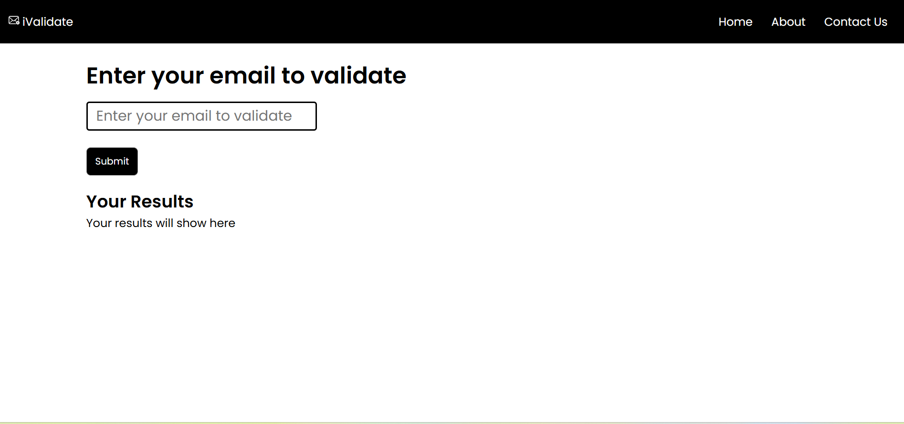
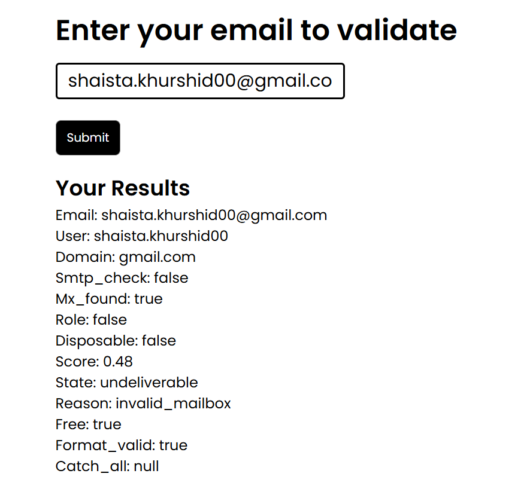

# 📧 iValidate - Email Validator

**iValidate** is a simple and user-friendly web application that allows users to validate email addresses using the **EmailValidation API**.

The application takes an email address as input, sends it to the EmailValidation API, and displays detailed information about the email address, including its domain, SMTP status, MX records, validation score, deliverability state, and other useful details.

---

## ✨ Features

- 📧 Validate email addresses
- 🔌 Integrated with the EmailValidation API
- 📊 Display detailed validation results
- 🔍 Check email format
- 🌐 Display email domain information
- 📬 Check SMTP status
- 📡 Check MX record availability
- 🚫 Detect disposable email addresses
- ⭐ Display email validation score
- 📋 Display the reason for the validation result
- 🎨 Simple and clean user interface
- 📱 Responsive design

---

## 🛠️ Technologies Used

| Technology | Purpose |
|---|---|
| **HTML5** | Structure of the web application |
| **CSS3** | Styling and responsive design |
| **JavaScript** | Application logic and API integration |
| **EmailValidation API** | Email validation and verification |

---

## ⚙️ How It Works

The application follows a simple process:

1. The user enters an email address.
2. The user clicks the **Submit** button.
3. JavaScript sends the email address to the **EmailValidation API**.
4. The API processes and validates the email address.
5. The API returns the validation data.
6. JavaScript processes the response.
7. The results are displayed under **Your Results**.

---

## 📋 Validation Results

The application displays several details returned by the API:

| Result | Description |
|---|---|
| **Email** | The email address entered by the user |
| **User** | The username portion of the email |
| **Domain** | The domain associated with the email |
| **SMTP Check** | SMTP verification status |
| **MX Found** | Indicates whether MX records were found |
| **Role** | Indicates whether the email is a role-based address |
| **Disposable** | Indicates whether the email is from a disposable email provider |
| **Score** | Validation score returned by the API |
| **State** | Overall validation/deliverability state |
| **Reason** | Reason provided by the API |
| **Free** | Indicates whether the email belongs to a free email provider |
| **Format Valid** | Indicates whether the email format is valid |
| **Catch All** | Indicates whether the domain accepts all email addresses |

---

## 📂 Project Structure

```text
email-validator/
│
├── .vscode/
│
├── css/
│   └── style.css
│
├── img/
│   ├── email-validator.png.png
│   ├── email.svg
│   ├── loading.svg
│   └── validation-results.png.png
│
├── js/
│   └── script.js
│
├── .gitattributes
├── index.html
└── README.md

````markdown
# 📧 iValidate - Email Validator

**iValidate** is a simple and user-friendly web application that allows users to validate email addresses using the **EmailValidation API**.

The application takes an email address as input, sends it to the EmailValidation API, and displays detailed information about the email address, including its domain, SMTP status, MX records, validation score, deliverability state, and other useful details.

---

## ✨ Features

- 📧 Validate email addresses
- 🔌 Integrated with the EmailValidation API
- 📊 Display detailed validation results
- 🔍 Check email format
- 🌐 Display email domain information
- 📬 Check SMTP status
- 📡 Check MX record availability
- 🚫 Detect disposable email addresses
- ⭐ Display email validation score
- 📋 Display the reason for the validation result
- 🎨 Simple and clean user interface
- 📱 Responsive design

---

## 🛠️ Technologies Used

| Technology | Purpose |
|---|---|
| **HTML5** | Structure of the web application |
| **CSS3** | Styling and responsive design |
| **JavaScript** | Application logic and API integration |
| **EmailValidation API** | Email validation and verification |

---

## ⚙️ How It Works

The application follows a simple process:

1. The user enters an email address.
2. The user clicks the **Submit** button.
3. JavaScript sends the email address to the **EmailValidation API**.
4. The API processes and validates the email address.
5. The API returns the validation data.
6. JavaScript processes the response.
7. The results are displayed under **Your Results**.

---

## 📋 Validation Results

The application displays several details returned by the API:

| Result | Description |
|---|---|
| **Email** | The email address entered by the user |
| **User** | The username portion of the email |
| **Domain** | The domain associated with the email |
| **SMTP Check** | SMTP verification status |
| **MX Found** | Indicates whether MX records were found |
| **Role** | Indicates whether the email is a role-based address |
| **Disposable** | Indicates whether the email is from a disposable email provider |
| **Score** | Validation score returned by the API |
| **State** | Overall validation/deliverability state |
| **Reason** | Reason provided by the API |
| **Free** | Indicates whether the email belongs to a free email provider |
| **Format Valid** | Indicates whether the email format is valid |
| **Catch All** | Indicates whether the domain accepts all email addresses |

---

## 📂 Project Structure

```text
email-validator/
│
├── .vscode/
│
├── css/
│   └── style.css
│
├── img/
│   ├── email-validator.png.png
│   ├── email.svg
│   ├── loading.svg
│   └── validation-results.png.png
│
├── js/
│   └── script.js
│
├── .gitattributes
├── index.html
└── README.md
````

---

## 📸 Project Preview

### Email Validation Interface



### Validation Results



---

## 🔑 API Integration

This project uses the **EmailValidation API** to validate email addresses.

When an email is submitted, JavaScript sends a request to the API and processes the response. The validation information returned by the API is then displayed dynamically on the webpage.

> **Note:** API access may require an API key. Keep API credentials secure and avoid exposing private API keys in publicly accessible code.

---

## 📚 What I Learned

While building this project, I learned about:

* Creating webpages using HTML
* Styling webpages using CSS
* Handling user input with JavaScript
* Working with external APIs
* Sending API requests
* Processing API responses
* Working with JSON data
* DOM manipulation
* Displaying dynamic data on a webpage
* Basic error handling
* Responsive web design
* Integrating third-party APIs into a web application

---

## 🚀 Future Improvements

Some improvements that could be added in the future:

* ⏳ Add a better loading animation
* 🎨 Improve the overall UI/UX
* 🟢 Add color-coded validation statuses
* ⚠️ Improve error handling and user feedback
* ✏️ Add email typo suggestions
* 📱 Further improve mobile responsiveness
* 🕒 Add email validation history
* 📊 Present validation results using cards or a dashboard
* ♿ Improve accessibility

---

## 🤝 Contributing

Suggestions and improvements are welcome.

If you find a bug or have an idea for improving the project, feel free to open an **Issue** or submit a **Pull Request**.

---

## 📄 License

This project was created for **learning and educational purposes**.

---


```
```
